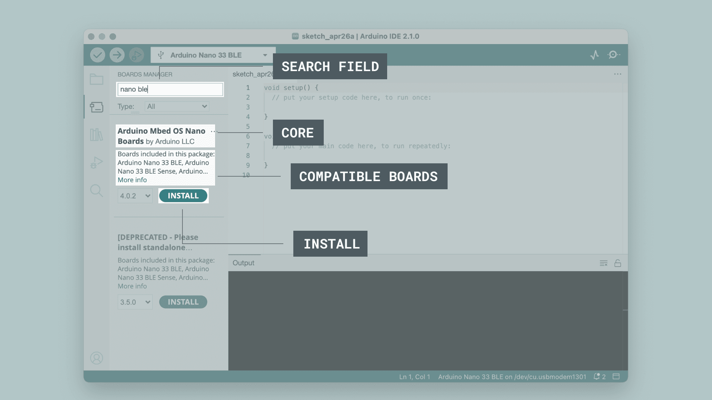
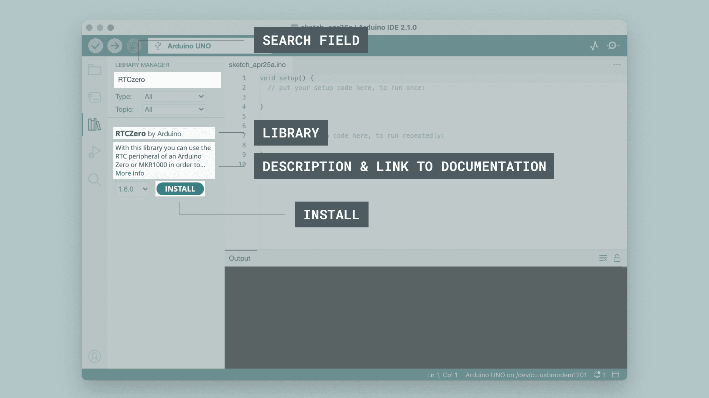
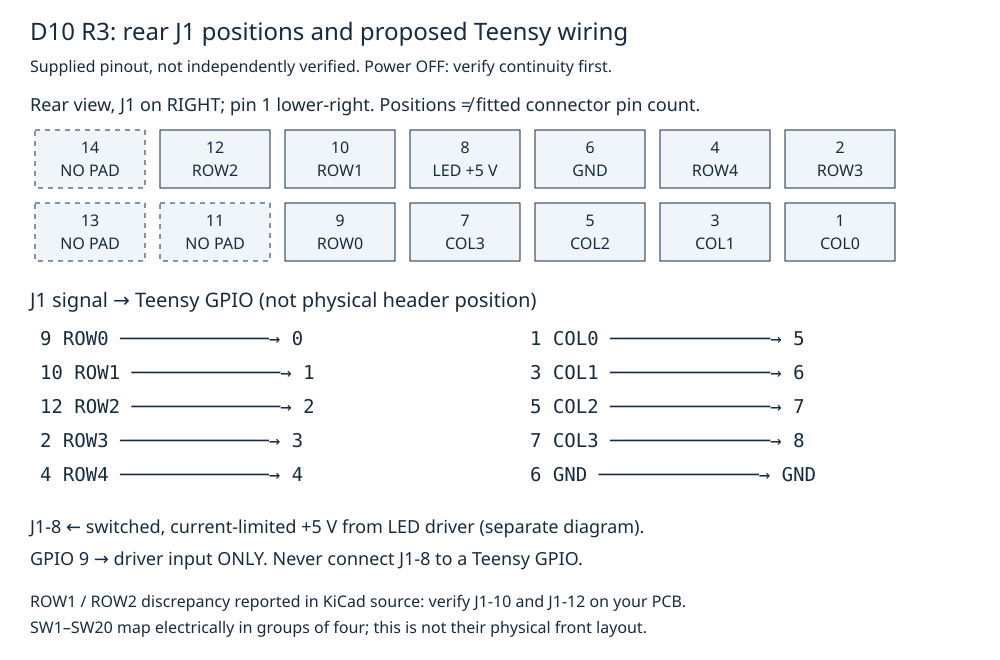
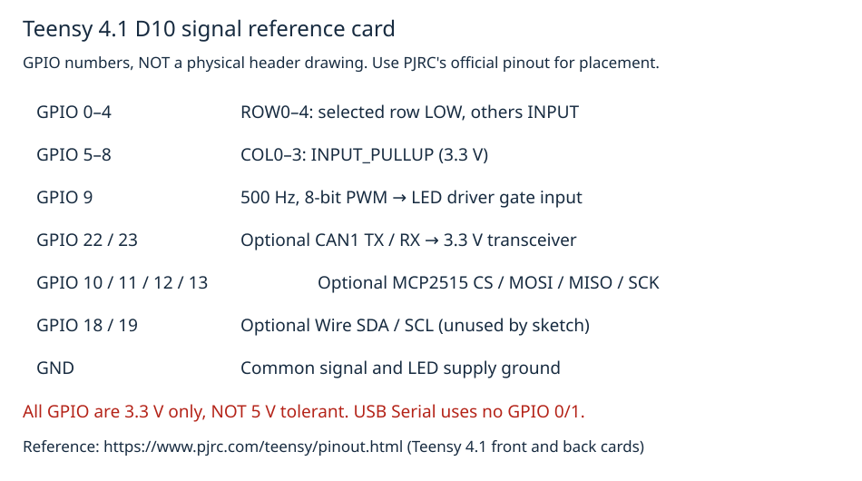
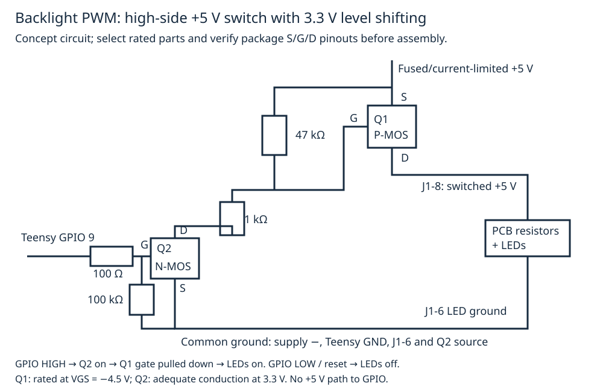

# D10 button matrix: Arduino IDE + Teensy 4.1 bench guide

This guide takes you from an empty Arduino IDE installation to serial testing of
20 D10 buttons and backlight PWM. The complete sketch and assignment header are
in [firmware/d10_efis_button_control](firmware/d10_efis_button_control).
Download **both files**, or download the repository ZIP and extract it.

**Bench demonstration, not flight-ready avionics.** Button names are proposed
application requests, not implemented aircraft functions. This sketch does not
engage an autopilot, operate a radio, switch LiDAR power, or drive CM5 boot pins.
An emergency COM path must work independently of the failed EFIS; a CAN event
alone does not provide that redundancy. Do not connect these examples to live
aircraft controls. The optional CAN examples below define a demonstration
protocol only; there is no CM5 receiver in this repository.

## Before starting

Have a Teensy 4.1, a USB **data** cable, your assembled D10 R3 PCB, a multimeter,
and jumper wires. Backlight testing additionally needs a separately rated,
current-limited 5 V supply and a suitable LED driver.

The J1 mapping below comes from the supplied R3 manufacturing pinout in the
issue conversation. **No schematic, Gerbers, PCB photograph, or continuity
measurements are present here to independently verify it.** A ROW1/ROW2 labeling
discrepancy was reported in the KiCad source. Verify every connection with power
disconnected, especially J1-10 and J1-12, before applying power.

Screenshots are unmodified, licensed examples from Arduino's IDE 2 tutorials.
They show other boards/libraries, **not evidence of Teensy installation or a
D10 upload**. Your current IDE may look different. Follow the Teensy-specific
text, not the example board names. [Image sources and license](#screenshot-attribution).

## Phase 1 — Install Arduino IDE and Teensy support

### 1.1 Download and install

1. Open <https://www.arduino.cc/en/software>.
2. Choose the latest **stable Arduino IDE 2.x** for your operating system.
   At guide preparation, the official latest release was 2.3.10; use the current
   stable release when following this guide, not a nightly build.
3. Windows: run the installer. macOS: open the DMG and move Arduino IDE to
   Applications. Linux: use Arduino's installation instructions for the chosen
   distribution/AppImage; additional system packages may be necessary.
4. Launch Arduino IDE. Allow initial package/library index downloads to finish.
   Internet access is needed for first installation.

### 1.2 Add PJRC's Boards Manager URL

1. Open **File → Preferences** on Windows/Linux, or **Arduino IDE →
   Settings/Preferences** on macOS.
2. Find **Additional Boards Manager URLs**.
3. Add the URL below. Preserve any URLs you already use; the adjacent list
   editor lets you put each URL on its own line.

   ```text
   https://www.pjrc.com/teensy/package_teensy_index.json
   ```

4. Click **OK**. Do not install a random similarly named third-party core.
   See [PJRC's official installation instructions](https://www.pjrc.com/teensy/td_download.html).
   IDE 2 uses Boards Manager; the older Teensyduino installer instructions for
   IDE 1.x are a different installation path.

### 1.3 Install the Teensy package

1. Open **Tools → Board → Boards Manager**, or click the board-shaped icon in
   the left sidebar.
2. Search for **Teensy**.
3. Select the **Teensy** package provided by **PJRC** and install its latest
   stable version. Allow time for the compiler and upload tools to download.
4. Confirm that the package reports an installed version. Record that version
   for reproducible builds.



*Official UI example: this screenshot searches for Nano 33 BLE. For this
project, search for Teensy and install the PJRC package instead.*

### 1.4 Select the board and build settings

Select **Tools → Board → Teensy → Teensy 4.1** (submenu wording may vary).
The board-specific Tools entries appear only after selecting Teensy.

| Setting | First bench run | Meaning |
|---|---|---|
| Board | Teensy 4.1 | Not Teensy 4.0, Uno, or Nano |
| USB Type | Serial | Enables USB `Serial` and Serial Monitor |
| CPU Speed | 600 MHz | Normal rated/default speed, **not** overclocking |
| Optimize | Faster | Suitable for this simple scanning sketch |
| Serial Monitor baud | 115200 | Matches the sketch's conventional setting |

Leave other settings at their defaults. Some packages offer 528 MHz as a lower
CPU speed; it is optional, not required. Higher-than-rated CPU speeds are
overclocking and are not needed here. CPU MHz, CAN bitrate, hardware UART baud,
and USB transfer speed are different settings.

On Teensy, `Serial` is native USB: `Serial.begin(115200)` and the monitor's baud
selector **do not change USB bus speed**. `Serial1.begin(115200)` would configure
a hardware UART, but this sketch does not use `Serial1`. GPIO 0 and 1 therefore
remain available for matrix rows.

### 1.5 Connect and identify the port

1. Connect Teensy using a known USB data cable, initially without the PCB.
2. Open **Tools → Port**, or use the toolbar's board/port selector.
3. A running USB-Serial sketch typically appears as `COMx` on Windows,
   `/dev/cu.usbmodem…` on macOS, or `/dev/ttyACM…` on Linux. Choose the entry
   that disappears/reappears when you unplug/reconnect this board.
4. If the existing program is not a USB-Serial sketch, no serial port may
   appear yet. Teensy's programming interface is USB HID; the first upload
   can be initiated with the board's **Program** button without a COM port.

Teensy is **not an FTDI USB adapter**; installing FTDI drivers is not the fix.
For Linux install PJRC's [Teensy udev rules](https://www.pjrc.com/teensy/loader_linux.html)
as instructed, then reconnect. Use
[PJRC troubleshooting](https://www.pjrc.com/teensy/troubleshoot.html) for
platform-specific driver/permission issues.

## Phase 2 — Libraries and dependencies

### 2.1 Understand what is required

The base matrix sketch needs only the installed Teensy board package and the
local `d10_button_assignments.h`. You do **not** need a CAN library for the first
button test.

| Library/header | Purpose | Installation |
|---|---|---|
| `Arduino.h` | GPIO, time, USB serial, PWM | Teensy core; included by the local header |
| `Wire.h` | Optional I²C sensors | Provided with Teensy; unused by base sketch |
| `SPI.h` | Optional external SPI peripherals | Provided with Teensy; unused by base sketch |
| `FlexCAN_T4.h` | Teensy native CAN controllers | Included in contemporary Teensy packages; verify it below |
| `mcp2515.h` | Optional external MCP2515 controller | Library Manager: **autowp-mcp2515**, by autowp |

There is no additional generic `CAN.h` dependency for these examples.
`FlexCAN_T4` and `autowp-mcp2515` have different APIs; do not mix them with an
unrelated library named “CAN.” Choose **one** CAN implementation later.

### 2.2 Library Manager walkthrough

1. Click the books/library icon in the left sidebar, or open **Sketch →
   Include Library → Manage Libraries** (also **Tools → Manage Libraries**
   in applicable releases).
2. Shortcut: **Ctrl+Shift+I** on Windows/Linux; **Cmd+Shift+I** on macOS.
3. Only if using MCP2515, search `autowp-mcp2515`, check the author, choose a
   stable version, and click **Install**. Accept any required dependencies.
4. After installation, verify the installed version in its entry; use the
   **Installed** filter to find Library Manager-installed libraries.



*Official UI example installs RTCZero. Substitute autowp-mcp2515 only if using
that external controller. Board-bundled libraries need not appear in the
Library Manager Installed filter; do not install random Wire/SPI replacements.*

### 2.3 Verify libraries

With **Teensy 4.1 selected**, check **File → Examples** for Wire/SPI/FlexCAN_T4
examples. Open an example and use **Verify** before connecting peripherals.
If FlexCAN_T4 is missing, first update/reinstall the PJRC Teensy package.
The upstream library is <https://github.com/tonton81/FlexCAN_T4>; if needed,
download a release ZIP and use **Sketch → Include Library → Add .ZIP Library**.
Avoid duplicate copies overriding the board package's copy.

An optional, separate dependency-check sketch is:

```cpp
#include <Wire.h>
#include <SPI.h>
#include <FlexCAN_T4.h>
void setup() {}
void loop() {}
```

For MCP2515 instead, use `#include <SPI.h>` and `#include <mcp2515.h>`.
Successful verification checks header availability, not peripheral wiring.
Enable verbose compilation in Preferences to see which library path/version
the compiler actually selects. “Multiple libraries were found” identifies
competing copies; check the **Used** path rather than assuming every copy works.

## Phase 3 — Create the sketch

### 3.1 New sketch and file layout

1. Select **File → New Sketch**.
2. Select **File → Save As**, name it **d10_efis_button_control**, and choose
   your Arduino sketchbook location (for example
   `~/Arduino/sketches/d10_efis_button_control/`).
3. The folder and main `.ino` basename must match:

   ```text
   d10_efis_button_control/
     d10_efis_button_control.ino
     d10_button_assignments.h
   ```

4. Open the sketch tab menu (ellipsis/dropdown) and choose **New Tab**, enter
   `d10_button_assignments.h`, and save. Alternatively create the header in
   the sketch folder with a text editor; ensure it is not saved as `.h.txt`.
5. Replace the blank sketch with the complete
   [main sketch](firmware/d10_efis_button_control/d10_efis_button_control.ino).
   Copy the complete
   [assignment header](firmware/d10_efis_button_control/d10_button_assignments.h)
   into the header tab. Save both files.

**Simpler alternative:** copy the supplied `firmware/d10_efis_button_control`
folder to your sketchbook and open its `.ino` directly using **File → Open**.
The checked-in pair of files is the complete working example; no “earlier
header” or external generated firmware is needed.

### 3.2 Understand the structure

- `#include "d10_button_assignments.h"` loads button IDs and labels from the
  same folder. Quoted includes are appropriate for your local header.
- `setup()` runs once at startup: configures GPIO, PWM, and serial. Its USB
  wait is limited to two seconds, so unplugged serial does not block scanning.
- `loop()` runs repeatedly: scans every 10 ms and handles serial test commands.
- `.h` files declare shared types/functions/constants. If you later split the
  implementation into `.cpp` files, explicitly include `Arduino.h` and your
  headers there; Arduino's automatic function prototypes apply to `.ino`,
  not ordinary `.cpp`.
- No extra `.c`, PlatformIO configuration, or external application is required.
  Teensy's library APIs used here are C++.

### 3.3 GPIO configuration

These arrays in the sketch must match **your continuity-checked wiring**:

```cpp
constexpr uint8_t NUM_ROWS = 5;
constexpr uint8_t NUM_COLS = 4;
constexpr uint8_t row_pins[NUM_ROWS] = {0, 1, 2, 3, 4};
constexpr uint8_t col_pins[NUM_COLS] = {5, 6, 7, 8};
constexpr uint8_t led_pwm_pin = 9;
```

`button_id = row * 4 + col`; SW1 is ID 0, SW20 is ID 19. The
`static_assert` checks that the dimensions and assignment count agree.
These are **GPIO numbers**, not positions counted along Teensy's headers.

### 3.4 Scanning, debounce, and holds

1. All rows are normally `INPUT` without pull-ups (high impedance).
2. Columns are `INPUT_PULLUP` at **3.3 V**: idle reads HIGH.
3. One row becomes an OUTPUT LOW, the sketch waits 50 µs, then reads its four
   columns. LOW means pressed.
4. That row returns to high impedance **before** selecting the next row.
   This avoids tying a driven-HIGH row to a driven-LOW row through switches.
5. After all rows are inactive, the sketch processes the sampled states and
   prints events.
6. Raw and confirmed state both begin **released**. A candidate state must
   remain unchanged for at least 20 ms before confirmation (roughly 20–30 ms
   detection latency at this scan rate). This avoids startup release events.
7. A confirmed press produces one PRESS; a confirmed release produces one
   RELEASE. At 500 ms after a confirmed press, HELD is emitted once while
   still pressed. MENU/DIM prints an extra brightness-test hint.

Unsigned elapsed-time subtraction tolerates `millis()` rollover. Increase
`DEBOUNCE_MS` to 30 if necessary, but investigate electrical noise first.
Diodes must permit current **from the pulled-up column toward the active LOW
row**. The supplied conversation does not independently establish polarity:
verify it in diode mode. A diode-less/wrongly assembled matrix can ghost;
debounce does not fix ghosting.

## Phase 4 — Compile and upload

### 4.1 Verify before wiring

1. Confirm Teensy 4.1, USB Type Serial, CPU 600 MHz, Optimize Faster.
2. Click **✓ Verify**, or **Ctrl+R** (Windows/Linux) / **Cmd+R** (macOS).
3. Inspect the **Output** panel at the bottom. A successful build reports
   memory usage and no compiler errors; exact wording/size varies with the
   installed Teensy package. Teensy may report separate FLASH/RAM regions.
4. If it fails, read the **first actionable error**, not just the final
   `exit status 1` line. Click file/line links where available.

| Compiler message | Check |
|---|---|
| `d10_button_assignments.h: No such file or directory` | Header is in the same sketch folder, exact spelling/extension |
| `FlexCAN_T4.h` / `mcp2515.h` not found | Optional library/core installed; correct library chosen |
| `analogWriteFrequency` not declared | Correct Teensy board/core selected |
| `redefinition of setup` or `loop` | Blank/example functions were replaced, not appended; no duplicate `.ino` tabs |
| Syntax error | Copy the full files, not Markdown fences; inspect the indicated line and preceding line |
| Package/index download error | Internet, proxy/firewall, PJRC URL; not a matrix-code failure |

Do not upload until Verify succeeds on your computer.

### 4.2 Upload

1. Connect Teensy alone with the USB data cable.
2. Select its port under **Tools → Port**, if one is available.
3. Click **→ Upload**, or **Ctrl+U** / **Cmd+U**.
4. Teensy Loader may open as part of uploading. Keep **Auto** mode enabled.
   If prompted or automatic programming fails, **briefly press the Teensy's
   Program button** to enter programming mode. Do not hold it for a factory
   restore.
5. Wait for the IDE/Loader to indicate completion. The board restarts into
   this sketch and should enumerate as USB Serial. Reselect the new port if
   its name changed.

Loader need not close automatically. There is **no required built-in LED
blink** in this sketch; USB serial output, not a blink, is the verification.
Avoid simultaneous external power/USB backfeeding: follow PJRC's VUSB/VIN
guidance if powering Teensy separately.

### 4.3 Serial Monitor

Open **Tools → Serial Monitor**, the top-right monitor icon, or
**Ctrl+Shift+M** / **Cmd+Shift+M**. Set its baud selector to **115200**.


*Official UI example prints “Hello world!” on an Arduino board. Your D10
sketch produces the output below. Its USB baud selector does not set bus speed.*

Expected startup output:

```text
D10 bench: 5 rows x 4 columns; no aircraft outputs
0=off, 1=25%, 2=50%, 3=100%, s=scan debug, ?=help
[LED] Brightness 0 (0%)
```

If you opened the monitor too late to see startup, send `?` followed by Enter
to print help again. The sketch ignores CR/LF, so any line-ending selector
works. Close other serial applications if the port is busy.

## Phase 5 — Wiring and pinout references

Disconnect **all power** before wiring. Connect the nine matrix signals and
common ground first; leave J1-8 disconnected until the LED driver is verified.
Teensy 4.1 GPIO is **not 5 V tolerant**. Never connect +5 V to a matrix
row/column or directly to GPIO 9.

### 5.1 J1 rear view and wiring



The supplied drawing numbers **14 positions with 11 copper pads**, not a
simple single-row 12-pin sequence. Look directly at the rear with J1 on your
right: position 1 is lower-right, 2 directly above, numbers increase toward
the left. Confirm the actual fitted connector alignment; do not assume its
pin count matches the footprint numbering.

| J1 position | Signal | Teensy connection |
|---|---|---|
| 1 | COL0 | GPIO 5 |
| 2 | ROW3 | GPIO 3 |
| 3 | COL1 | GPIO 6 |
| 4 | ROW4 | GPIO 4 |
| 5 | COL2 | GPIO 7 |
| 6 | LED/common ground | GND |
| 7 | COL3 | GPIO 8 |
| 8 | +5 V backlight supply | **LED driver switched supply, never a GPIO** |
| 9 | ROW0 | GPIO 0 |
| 10 | ROW1 | GPIO 1 |
| 11 | No copper pad | No connection |
| 12 | ROW2 | GPIO 2 |
| 13, 14 | No copper pad | No connection |

### 5.2 Switch functions and electrical matrix

Rows are electrical groupings, not a drawing of front-panel placement.
Assignments below implement the requested labels; the remaining labels are
suggestions and can be changed in the header.

| Row / J1 | COL0 / J1-1 | COL1 / J1-3 | COL2 / J1-5 | COL3 / J1-7 |
|---|---|---|---|---|
| ROW0 / 9 | SW1 / 0 LIDAR | SW2 / 1 AUTOPILOT | SW3 / 2 EMERG COM | SW4 / 3 CM5 BOOT |
| ROW1 / 10 | SW5 / 4 MAP | SW6 / 5 COM EDIT | SW7 / 6 NAV EDIT | SW8 / 7 ENGINE MON |
| ROW2 / 12 | SW9 / 8 TRAFFIC | SW10 / 9 PFD | SW11 / 10 DIRECT TO | SW12 / 11 FLIGHT PLAN |
| ROW3 / 2 | SW13 / 12 AIRPORT | SW14 / 13 COM SWAP | SW15 / 14 NAV SWAP | SW16 / 15 XPDR |
| ROW4 / 4 | SW17 / 16 BARO | SW18 / 17 ALERT ACK | SW19 / 18 BACK | SW20 / 19 MENU/DIM |

The supplied switch footprint description says contact pads 3/4 go to the
row, contact pads 1/2 go through the series diode to the column, LED pad 5
is negative (J1-6), and LED pad 6 is resistor-fed positive (J1-8).
It describes pad 6 above pad 5 in the front drawing. **Check the actual
switch datasheet and PCB markings**, not appearance alone: the four contact
pads are duplicated terminals for one contact, not two independent buttons.
Do not rotate a switch based solely on this unverified description.

### 5.3 Teensy reference



This task-specific card is **not a physical header layout**. For actual pin
placement/orientation use PJRC's official
[Teensy 4.1 front/back pinout cards](https://www.pjrc.com/teensy/pinout.html).
Keep the USB connector orientation and GPIO labels visible while wiring.

### 5.4 Backlight PWM driver



J1-6 is the shared LED-negative ground and stays grounded. Consequently,
brightness control switches **J1-8's positive supply**, not common ground.
Use a rated high-side P-channel MOSFET Q1 with an N-channel gate pull-down
Q2, as shown:

- Q1 source → current-limited/fused +5 V; drain → J1-8.
- Q1 gate → source through 47 kΩ (defaults off).
- Q1 gate → 1 kΩ → Q2 drain.
- Q2 source → common ground; gate → GPIO 9 through 100 Ω.
- Q2 gate → ground through 100 kΩ (off while Teensy resets).
- Supply negative, Teensy GND, and J1-6 share ground.

Q1 must have an adequate continuous-current/thermal rating and specified
`RDS(on)` at approximately **−4.5 V VGS**; Q2 must pull the gate low at 3.3 V.
A small BSS138 can serve as **Q2's gate level shifter**, not as an assumed
20-LED power switch. Check each part's actual package pinout.
The values are a bench starting point, not a validated PCB design.

Confirm the PCB really includes suitable **LED current-limiting resistors**.
If not, provide properly calculated resistors per LED branch before power.
Measure total backlight current at 100% and size the supply, Q1, wiring, and
fuse appropriately. With a multimeter first check that Q1's output is off
at GPIO LOW and approximately +5 V at HIGH, with no +5 V reaching GPIO.
Do not reproduce the proposed drain-to-+5 V low-side circuit: turning it on
could short the supply. Do not feed the external LED +5 V into Teensy 3V3
or tie it to USB/VIN without a designed power arrangement.

The sketch explicitly uses `analogWriteResolution(8)` and
`analogWriteFrequency(9, 500)`. `analogWrite(9, brightness)` sends 0–255
duty: 0 = off, 128 ≈ 50%, 255 = full on for **this driver polarity**.
PWM is not a regulated analog supply voltage.

## Phase 6 — Bench testing and troubleshooting

### 6.1 Button test

1. After continuity/diode checks, connect the matrix with J1-8 still unpowered.
2. Power Teensy via USB and open Serial Monitor.
3. With no buttons pressed, verify **no PRESS/RELEASE events** appear.
4. Press and release SW1. Expected:

   ```text
   [PRESS] Button 0 (LIDAR)
     -> LiDAR toggle request (not connected)
   [RELEASE] Button 0 (LIDAR)
   ```

5. Repeat for all 20 switches using the mapping table; log missing/wrong IDs.
6. Hold SW20 for at least 500 ms. After PRESS there should be exactly one:

   ```text
   [HELD] Button 19 (MENU/DIM)
     -> Use 0/1/2/3 in Serial Monitor to test brightness
   ```

   Releasing produces RELEASE. Holds are measured after debounce confirmation.
   A short tap should not produce HELD.

### 6.2 Row/column diagnostics

Send `s` to enable diagnostics, limited to once every 250 ms. While SW1 is
pressed, expect:

```text
[SCAN] R0 C0..3=1000
[SCAN] R1 C0..3=0000
[SCAN] R2 C0..3=0000
[SCAN] R3 C0..3=0000
[SCAN] R4 C0..3=0000
```

`1` means sampled LOW/pressed. Released should be all zeros.
SW20 alone produces `R4 C0..3=0001`. Send `s` again to disable.
The diagnostic reflects raw samples, not only debounced events. To observe
actual row activation, use a scope/logic analyzer rated for 3.3 V: each row
should drive LOW only during its own roughly 50 µs settling/read interval,
once per full 10 ms scan.

Test two buttons together, then three corners of a matrix rectangle
(e.g. SW1, SW2, SW5). SW6 must **not** appear unless pressed. If it does,
investigate absent/reversed/shorted isolation diodes and wiring; do not rely
on debounce or claim this firmware guarantees diode-less multi-key rollover.

### 6.3 LED test

Only after verifying the driver, connect its switched output to J1-8.
Send `0`, `1`, `2`, `3` separately in the monitor:

| Command | `analogWrite` value | Expected |
|---|---|---|
| `0` | 0 | Off (also startup default) |
| `1` | 64 | About 25% duty |
| `2` | 128 | About 50% duty |
| `3` | 255 | Full on |

For `2`, expect `[LED] Brightness 128 (50%)`. Perceived brightness is not
necessarily linear in duty. Check supply current and component temperature;
disconnect immediately if excessive. Return to `0` after the test.
The commands already exist: no temporary sketch edits or potentially
wrapping unsigned fade counter are needed.

### 6.4 Common problems

| Symptom | Action |
|---|---|
| No serial port/output | Data cable, USB Type Serial, correct port, PJRC permissions; upload with Program button if necessary; send `?` |
| Port busy | Close another monitor/terminal; reconnect and reselect port |
| Upload waits/fails | Teensy Loader Auto mode, brief Program-button press, USB cable/port, Linux udev rules; do not install FTDI drivers |
| No buttons detected | Power off; continuity-check row/column arrays, common ground, diode direction, switch contacts |
| Four buttons swapped as a group | Verify ROW1/J1-10 versus ROW2/J1-12 against actual copper |
| Entire row/column stuck | Check shorts, incorrect pin mode/wiring, solder bridges; disconnect matrix to isolate |
| Chatter | Check wiring/noise/grounding; increase `DEBOUNCE_MS` to 30, recompile/upload |
| Phantom simultaneous keys | Check isolation diodes; debounce does not fix a ghost path |
| LEDs off | Verify supply, ground, Q1/Q2 pinouts, resistor network, PWM command and gate polarity |
| LEDs always on/hot | Remove power; inspect Q1 wiring/gate pull-up and LED current limiting |
| CAN does not send | Check chosen library, oscillator, bitrate, transceiver, termination and a second acknowledging node |

## Phase 7 — Button handler and optional CAN examples

### 7.1 Event handler template

The existing `on_button_pressed`, `on_button_released`, and `on_button_held`
functions are the extension points. **Edit them, do not add duplicate definitions.**
A display-request-only example is:

```cpp
void on_button_pressed(uint8_t id) {
  print_event(id, "PRESS");
  switch (id) {
    case BTN_MAP:
      Serial.println("Application request: open MAP page");
      break;
    case BTN_COM_EDIT:
    case BTN_NAV_EDIT:
      Serial.println("Application request: frequency editor");
      break;
    default:
      break;
  }
}
```

The receiving application must define toggle semantics, permissions,
acknowledgments, reconnect behavior, and safe defaults. These examples do
not define those behaviors. In particular, **CM5 BOOT is only a label**:
do not connect GPIO to Nano-B boot/reset/power pins without its authoritative
carrier-board documentation and a suitable interface. A boot-mode signal is
not an on/off power switch.

### 7.2 Demonstration CAN protocol

Test only on an isolated bench bus, not an operational avionics network.
Example standard 11-bit ID `0x500`, DLC 2:

| Byte | Meaning |
|---|---|
| 0 | Button ID 0–19 |
| 1 | Event: 1 press, 0 release, 2 held |

For SW1 press: `500 [2] 00 01`; release: `500 [2] 00 00`.
These are arbitrary demonstration values, **not an existing EFIS protocol**.
Reserve IDs and agree a bitrate with the receiving system before integration.
Send on transitions, not every scan. A successful library write only means
local acceptance/queueing, not that CM5 received or acted on it.

### 7.3 Option A — Native Teensy CAN1 (FlexCAN_T4)

Teensy has CAN controllers but needs an **external CAN transceiver** with
3.3 V-compatible MCU logic. For CAN1 connect GPIO **22 → TXD** and GPIO
**23 ← RXD**; transceiver CANH/CANL go to the bus, not directly to GPIO.
Connect common ground, configure any enable/standby pin per the transceiver
datasheet, and use 120 Ω termination at each of the two physical bus ends
(not at every node). An ordinary CAN bus needs another active node to ACK.

Add the following **above the sketch's event handlers**:

```cpp
#include <FlexCAN_T4.h>
FlexCAN_T4<CAN1, RX_SIZE_256, TX_SIZE_16> button_can;

void begin_button_can() {
  button_can.begin();
  button_can.setBaudRate(500000);  // Example only: match every bench node.
}

void send_button_can(uint8_t id, uint8_t event) {
  CAN_message_t msg = {};
  msg.id = 0x500;
  msg.len = 2;
  msg.buf[0] = id;
  msg.buf[1] = event;
  if (!button_can.write(msg)) {
    Serial.println("[CAN] Local transmit queue rejected event");
  }
}
```

Call `begin_button_can();` once at the end of `setup()`. Add
`send_button_can(id, 1);` to `on_button_pressed`,
`send_button_can(id, 0);` to `on_button_released`, and
`send_button_can(id, 2);` to `on_button_held`. Recompile before wiring.
Confirm frames with a second node/CAN analyzer. Production code also needs
receive processing, bus-off/error handling, bounded queues, and an application
delivery/acknowledgment strategy.

### 7.4 Option B — External MCP2515 (autowp)

Use this **instead of** Option A. MCP2515 is an SPI CAN controller and also
needs a CAN transceiver (many modules include one). GPIO assignments:
**10 CS, 11 MOSI, 12 MISO, 13 SCK**; no conflict with the matrix.
This polling/sending example does not require an interrupt pin.

**Generic 5 V MCP2515 modules are not automatically Teensy-safe.** Verify
MISO/INT levels and pull-ups, input thresholds, and transceiver operating
voltage from the module schematic/datasheets. Use a 3.3 V-logic-compatible
module or a correctly designed level interface; powering a 5 V transceiver
at 3.3 V is not a general solution.

Add above the event handlers:

```cpp
#include <SPI.h>
#include <mcp2515.h>
MCP2515 button_can(10);
bool button_can_ready = false;

void begin_button_can() {
  SPI.begin();
  // MCP_8MHZ is only for an 8 MHz crystal; use MCP_16MHZ if fitted.
  button_can_ready =
      button_can.reset() == MCP2515::ERROR_OK &&
      button_can.setBitrate(CAN_500KBPS, MCP_8MHZ) == MCP2515::ERROR_OK &&
      button_can.setNormalMode() == MCP2515::ERROR_OK;
  if (!button_can_ready) Serial.println("[CAN] MCP2515 initialization failed");
}

void send_button_can(uint8_t id, uint8_t event) {
  if (!button_can_ready) return;
  struct can_frame msg = {};
  msg.can_id = 0x500;
  msg.can_dlc = 2;
  msg.data[0] = id;
  msg.data[1] = event;
  if (button_can.sendMessage(&msg) != MCP2515::ERROR_OK) {
    Serial.println("[CAN] MCP2515 rejected event");
  }
}
```

Make the same `setup()` and handler calls listed for Option A. Check crystal
marking, bitrate, termination, and a second acknowledging node.
Do not add both examples at once: their intentionally identical helper names
would collide. See the [autowp library examples](https://github.com/autowp/arduino-mcp2515).

## Checklist before first run

- [ ] Current stable Arduino IDE 2.x installed.
- [ ] PJRC package URL added; Teensy package installed and version recorded.
- [ ] Teensy 4.1 / USB Serial / 600 MHz / Faster selected.
- [ ] Both `.ino` and `.h` in the correctly named sketch folder.
- [ ] Verify completed successfully locally.
- [ ] J1 numbering/alignment, each signal, and diode polarity checked unpowered.
- [ ] No +5 V connected to GPIO; J1-8 isolated until LED driver checks pass.
- [ ] Teensy uploaded; USB serial port identified and selected.
- [ ] Monitor at 115200; startup or `?` help output seen.
- [ ] Idle has no false events; all 20 IDs match the table.
- [ ] Short press/release and one-shot held events verified.
- [ ] Row/column and multi-key ghost tests passed.
- [ ] Optional LED driver off/on polarity, current limiting, and PWM tested.
- [ ] Optional CAN frames verified on an isolated bus with a second node.

## Validation status and next steps

This repository originally had only a README and no build/test infrastructure.
The sketch is written for Teensy 4.1's Arduino API; it has **not been
hardware-tested**. During preparation, Arduino CLI compilation could not start
because the sandbox could not resolve Arduino/PJRC package download hosts,
leaving `teensy:avr` uninstalled. Successful local Verify and all continuity/
bench checks above remain required; no screenshot is a claimed test result.

After bench verification, separately design the CM5 receiver and CAN protocol,
rotary encoder inputs, and application behavior. Independent emergency COM,
autopilot interfaces, CM5 boot/power handling, fault recovery, and aircraft
qualification require system-specific engineering beyond this demonstration.

## References

- [Arduino IDE downloads](https://www.arduino.cc/en/software)
- [PJRC Arduino/Teensy installation](https://www.pjrc.com/teensy/td_download.html)
- [Teensy 4.1 specifications and electrical limits](https://www.pjrc.com/store/teensy41.html)
- [PJRC USB Serial behavior](https://www.pjrc.com/teensy/td_serial.html)
- [PJRC pinout cards](https://www.pjrc.com/teensy/pinout.html)
- [PJRC libraries](https://www.pjrc.com/teensy/td_libs.html)
- [FlexCAN_T4 source and examples](https://github.com/tonton81/FlexCAN_T4)
- [autowp MCP2515 source and examples](https://github.com/autowp/arduino-mcp2515)

### Screenshot attribution

The three `docs/images/arduino-*.png` screenshots are reproduced **unmodified**
from Arduino Documentation, by Karl Söderby (Serial Monitor) and Karl Söderby &
Jacob Hylén (Boards Manager and Library Manager). They are provided **as-is,
without warranties**, under
[Creative Commons Attribution-ShareAlike 4.0](https://creativecommons.org/licenses/by-sa/4.0/);
see the upstream [license](https://github.com/arduino/docs-content/blob/e54e0f07c8e7cdd130da35f24b78d8be7fbdb99c/LICENSE.md).
Their inclusion does not imply Arduino or PJRC endorsement.

Source files at Arduino Documentation commit
`e54e0f07c8e7cdd130da35f24b78d8be7fbdb99c`:

- [Boards Manager: installing-a-core-img02.png](https://github.com/arduino/docs-content/blob/e54e0f07c8e7cdd130da35f24b78d8be7fbdb99c/content/software/ide-v2/tutorials/02.ide-v2-board-manager/assets/installing-a-core-img02.png)
- [Library Manager: installing-a-library-img02.png](https://github.com/arduino/docs-content/blob/e54e0f07c8e7cdd130da35f24b78d8be7fbdb99c/content/software/ide-v2/tutorials/ide-v2-installing-a-library/assets/installing-a-library-img02.png)
- [Serial Monitor: serial-monitor-img03.png](https://github.com/arduino/docs-content/blob/e54e0f07c8e7cdd130da35f24b78d8be7fbdb99c/content/software/ide-v2/tutorials/ide-v2-serial-monitor/assets/serial-monitor-img03.png)
